English | [中文](README_zh.md)

FreeCar is a cloud-native time-sharing car rental system suite based on Hertz and Kitex.

## Project Architecture

### Call Relationship


### Technology Architecture


### Service Relations

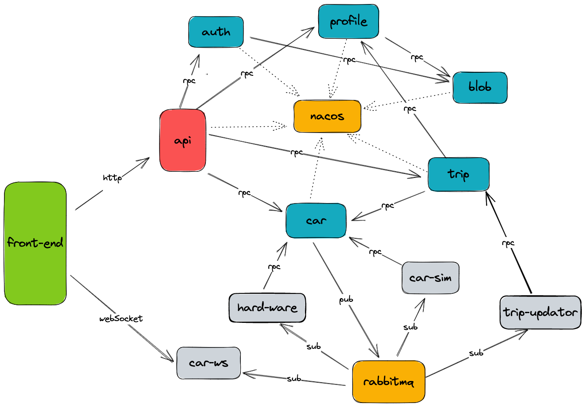

## Technology Stack

| Function                         | Implementation        |
|----------------------------------|-----------------------|
| HTTP Framework                   | Hertz                 |
| RPC Framework                    | Kitex                 |
| Database                         | MongoDB, MySQL, Redis |
| Authentication                   | Paseto                |
| Service and Configuration Center | Consul                |
| Metrics Monitoring               | Prometheus            | 
| Tracing                          | Jaeger                |
| Message Queue                    | RabbitMQ              |
| Service Governance               | OpenTelemetry         |
| Current Limiting Fuse            | Sentinel              |
| Object Storage                   | MinIO                 |
| Image Recognition                | Baidu OCR             |
| CI                               | GitHub Actions        |

## Display

### Mini Program

Mini program project address [FreeCar-MP](https://github.com/CyanAsterisk/FreeCar-MP)

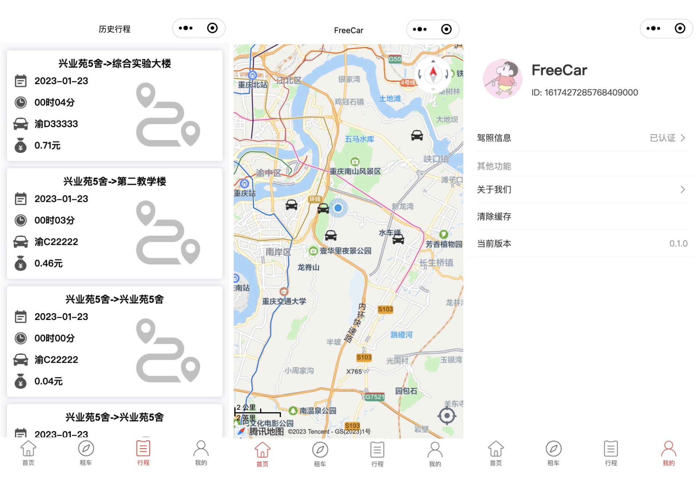

### Admin

Admin project address [FreeCar-Admin](https://github.com/CyanAsterisk/FreeCar-Admin)

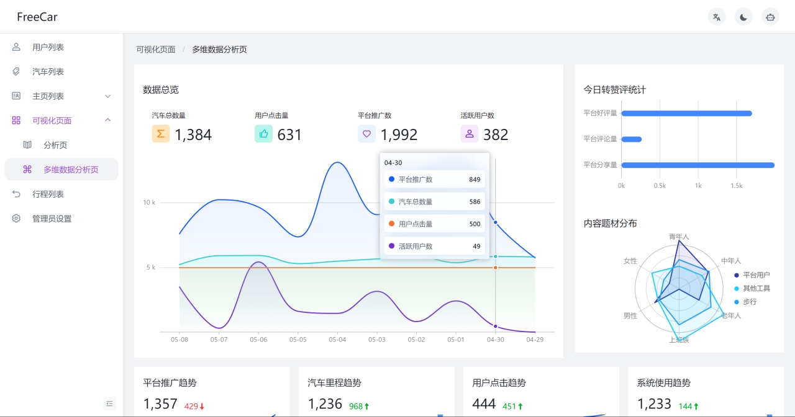

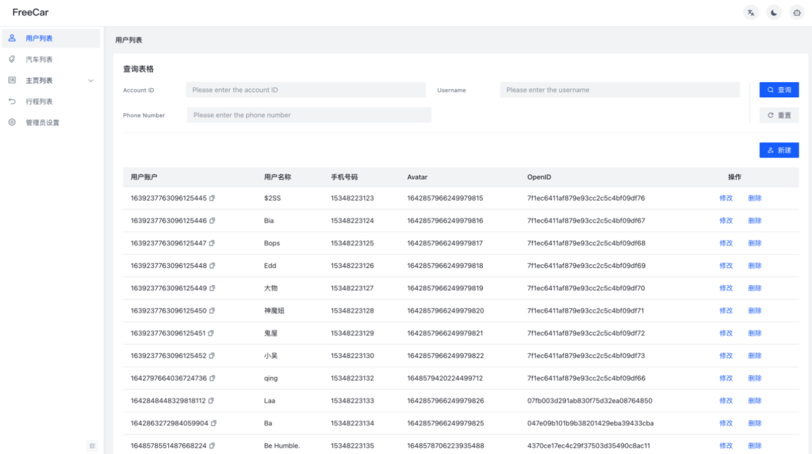

## Catalog Introduce

| Catalog | Introduction                             |
|---------|------------------------------------------|
| Cmd     | Project Core                             |
| Idl     | IDL file for all services of the project |
| Shared  | Reusable Code                            |

## Service Introduce

| Catalog | Introduction                                       |
|---------|----------------------------------------------------|
| API     | Hertz-based gateway service                        |
| User    | User Authentication Service                        |
| Blob    | Services related to image and MinIO object storage |
| Car     | Car Service                                        |
| Profile | Home Page and Image Recognition Service            |
| Trip    | Itinerary Services                                 |

## Quick start

### Start the Dependence

```shell
make start
```

### Consul

> For the default Consul address and KV configuration, please refer to each `config.yaml` configuration file.

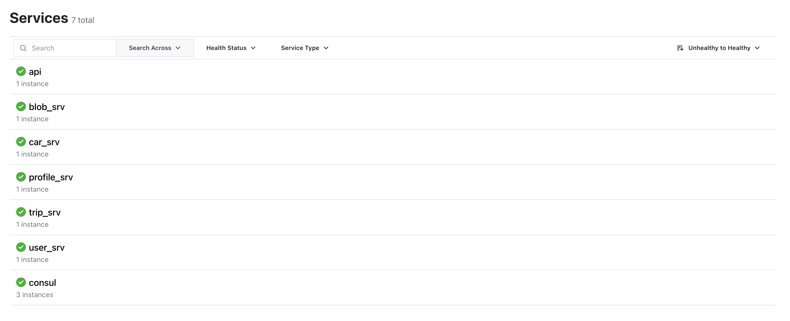

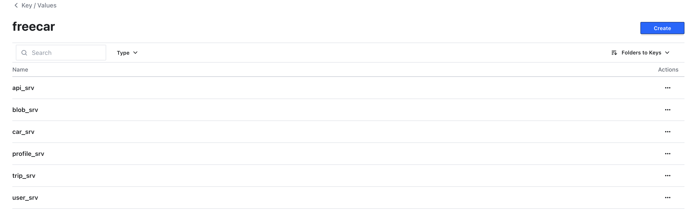

For detailed configuration of KV key-value pairs, [see](docs/CONSUL_CONFIG.md).

### Start HTTP

```shell
make api
```

### Start RPC

```shell
make user
make blob
make car
make profile
make trip
```

### Jaeger

> Visit `http://127.0.0.1:16686/` on your browser

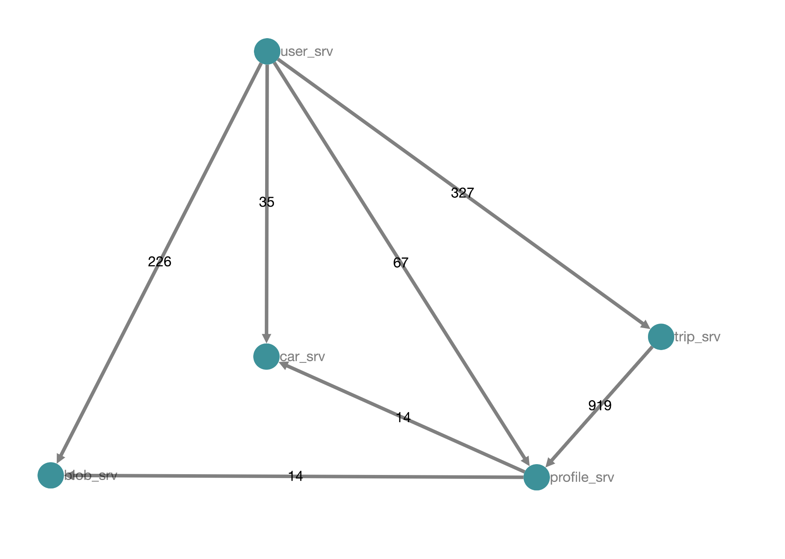

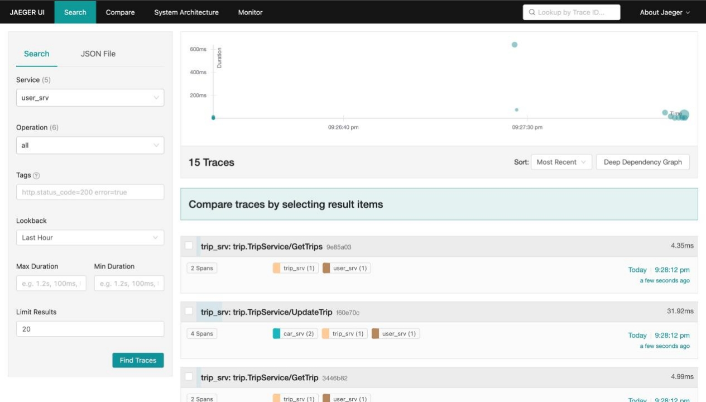

### Prometheus

> Visit `http://127.0.0.1:3000/` on your browser

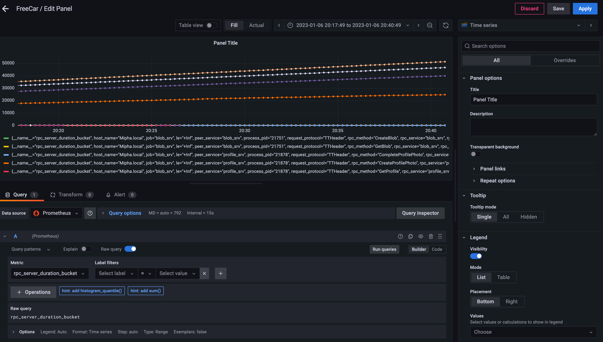

### MinIO

> Visit `http://127.0.0.1:9000/` on your browser

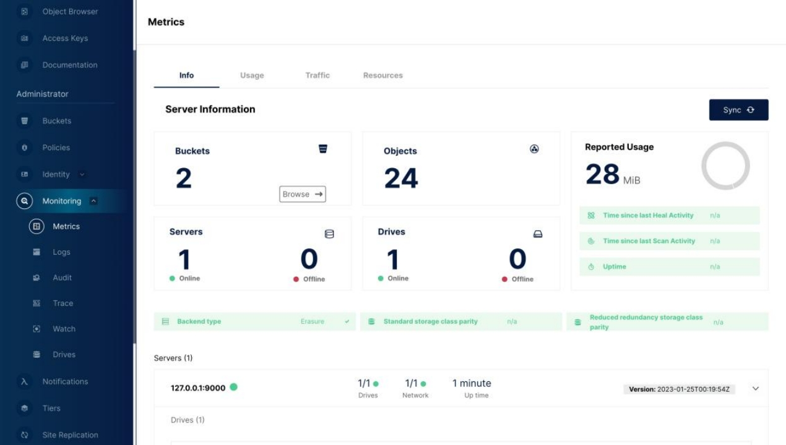

## Deploy the Basic Environment Through K8s

```shell
cd deployment/freecar-k8s
make all
```

### Pod

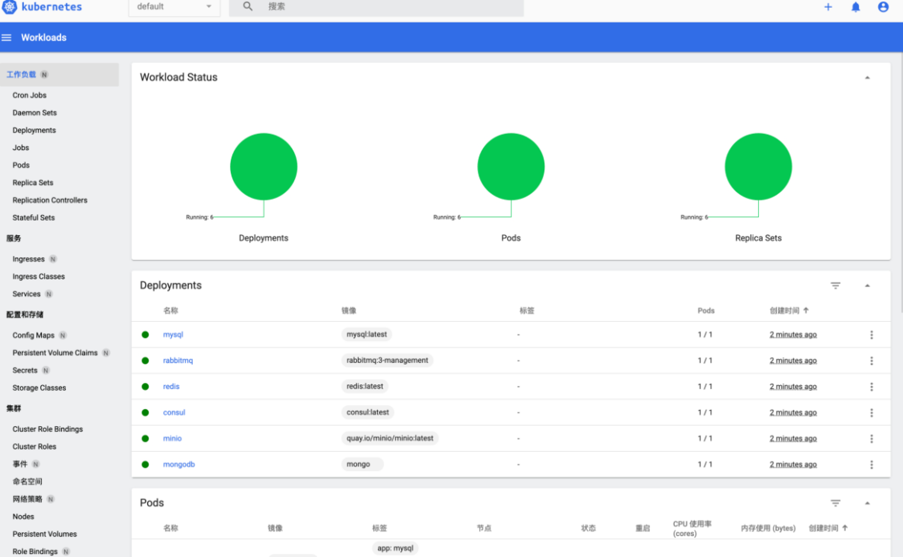

### PVC

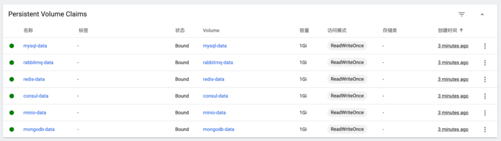

### Service

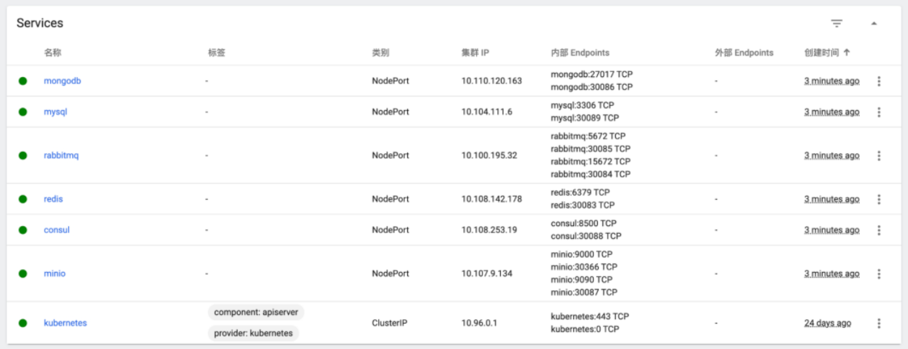

## Development Guide

It is very difficult to understand this project by directly reading the source code. Here is a development guide for
developers to quickly understand and get started with this project, including frameworks such as Kitex and Hertz.

### Preparation

Use the commands in the quick start to quickly start the required tools and environment. If you need special
customization, please modify the contents of `docker-compose.yaml` and Nacos configuration.

### IDL

Before development, we need to define the IDL file, among which hz provides developers with many
customized [api annotations](https://www.cloudwego.io/zh/docs/hertz/tutorials/toolkit/usage/annotation/#%E6%94%AF%E6%8C%81%E7%9A%84-api-%E6%B3%A8%E8%A7%A3).

Sample code:

```thrift
namespace go user

struct LoginRequest {
     1: string code
}

struct LoginResponse {
     1: i64 accountID
}

service UserService {
     LoginResponse Login(1: LoginRequest req)
}
```

### Code Generation

#### Kitex

First generate `kitex_gen` in the `shared` folder, and then rely on `kitex_gen` in the corresponding service folder to
generate. Execute under the new service directory, only need to change the service name and IDL path each time.

```shell
kitex -module github.com/CyanAsterisk/FreeCar ./../idl/rpc/user.thrift
kitex -service user -module github.com/CyanAsterisk/FreeCar -use github.com/CyanAsterisk/FreeCar/server/shared/kitex_gen ./../../idl/rpc/user.thrift
```

Note:

- Use `-module github.com/CyanAsterisk/FreeCar` This parameter is used to specify the Go module to which the generated
  code belongs to avoid path problems.
- When the current service needs to call other services, it needs to rely on `kitex_gen`.

#### Hertz

##### Initialize

```shell
hz new -idl ./../../idl/api.proto -mod github.com/CyanAsterisk/FreeCar/server/cmd/api
```

Note:

- Use `-module github.com/CyanAsterisk/FreeCar/server/cmd/api` This parameter is used to specify the Go module to which
  the generated code belongs to avoid path problems.

### Business Development

After the code is generated, some necessary components need to be added to the project. Since the api layer does not
need to be added again, the following mainly explains about Kitex-Server
section, the code is located under `server/cmd`.

#### Config

Refer to `server/cmd/user/config` for the configuration structure of microservices.

#### Initialize

Refer to `server/cmd/user/initialize` to provide the initialization function of the necessary components, among
which `config.go` `registry.go` `flag.go` `logger.go` are required.

#### Pkg

Refer to `server/cmd/user/pkg` to provide calling functions of microservices, which are mainly used to implement the
interfaces defined in `handler.go`.

#### API

When writing the business logic of the gateway layer, you only need to update the IDL and the new microservice client
code each time. If you need to add new components, you can add them directly. The project is highly pluggable, and the
architecture is similar to the microservice layer.

The business logic of the gateway layer is under `server/cmd/api/biz`, and most of the code will be automatically
generated. If you need to add a new route separately, you need to go to `server/cmd/api/router.go`.

Regarding the use of middleware, you only need to add middleware logic in `server/cmd/api/biz/router/api/middleware.go`.

## License

FreeCar is open source under the GNU General Public License version 3.0.
